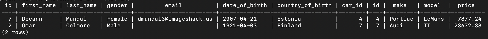
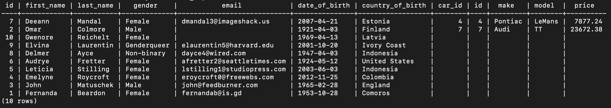
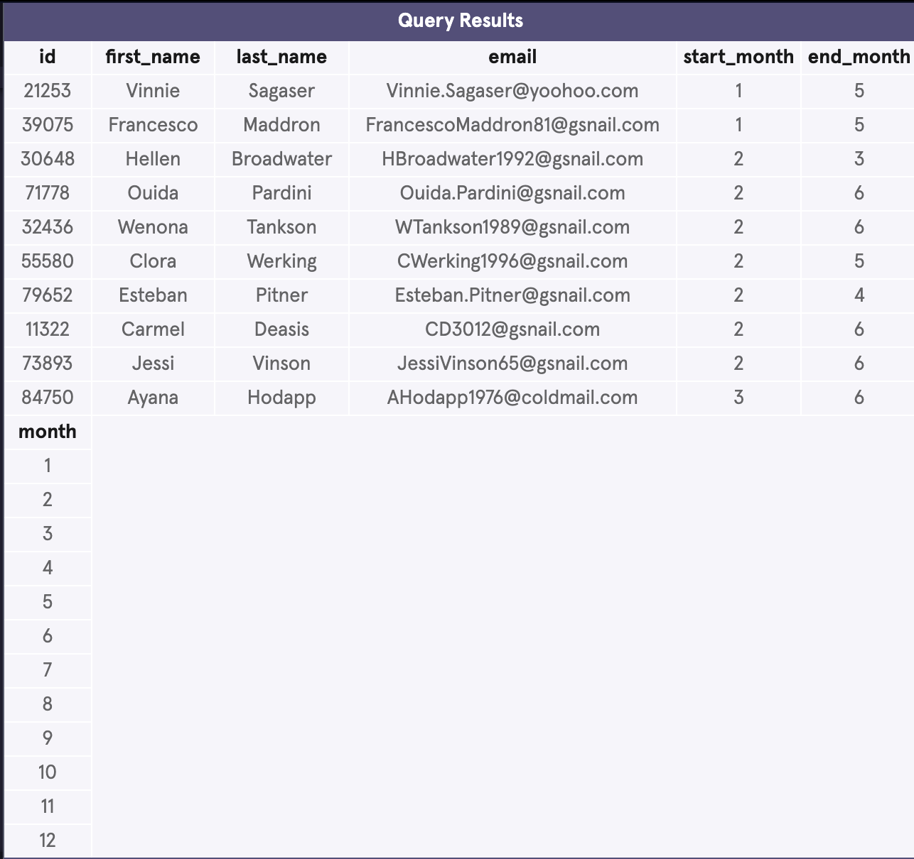
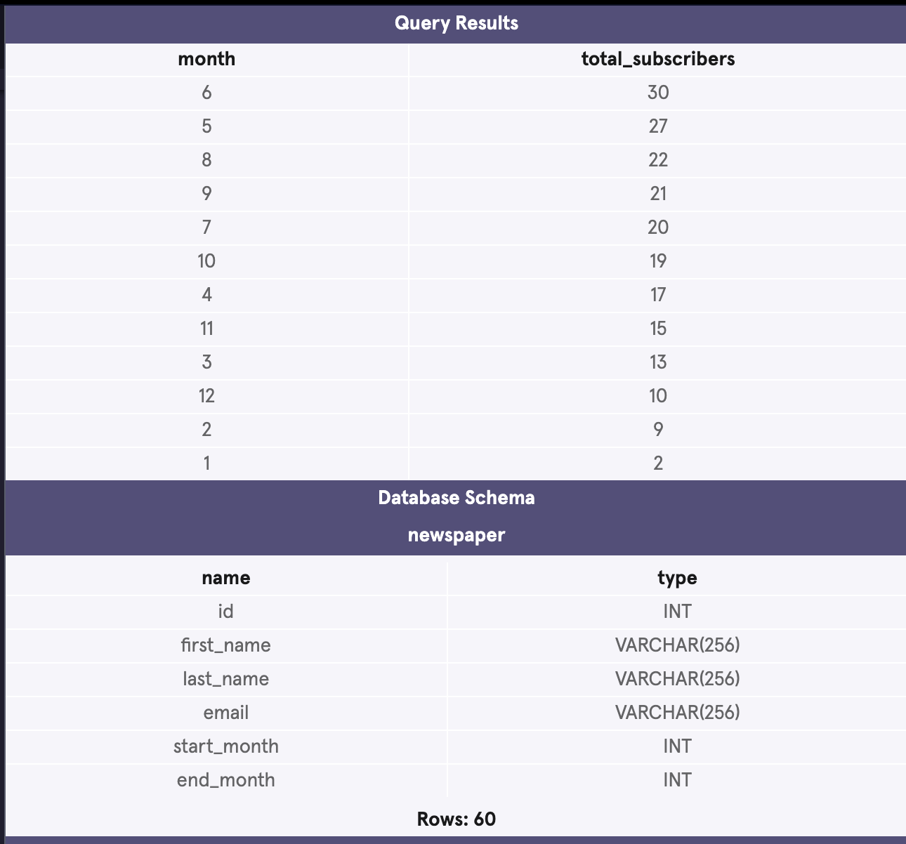
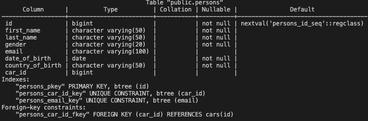
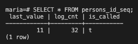

# 🐘 PostgreSQL Cheat Sheet

Documentation: https://www.postgresql.org/docs/current/

Don't forget semi-colon `;` at the end of each psql command to run it!

## Data types

most common data types in postgres

| Data Type  | Representation                                    | Value       | Display  |
| ---------- | ------------------------------------------------- | ----------- | -------- |
| integer    | whole number                                      | 617         | 617      |
| decimal    | floating-point number                             | 26.17345    | 26.17345 |
| money      | fixed floating-point number with 2 decimal places | 6.17        | $6.17    |
| boolean    | logic                                             | TRUE, FALSE | t, f     |
| char(n)    | fixed-length string, **removes trailing spaces!** | '123 '      | '123'    |
| varchar(n) | variable-length string                            | '123 '      | '123 '   |
| text       | unlimited-length string                           | '123 '      | '123 '   |

## Creating a databse / table

`CREATE DATABASE` or `CREATE TABLE` followed by `[name]`

```sql
CREATE TABLE cars (
	id BIGSERIAL NOT NULL PRIMARY KEY,
	make VARCHAR(100) NOT NULL,
	model VARCHAR(100) NOT NULL,
	price NUMERIC(19, 2) NOT NULL
);
```

## Updating a table

`ALTER TABLE` followed by `[table_name]` and adding whatever needed (e.g. column)
`ADD COLUMN` (needs column name and data type!, e.g. `INTEGER`)
or
`DROP COLUMN` to delete a column

```sql
ALTER TABLE table_name
ADD COLUMN new_column_name column_type;

ALTER TABLE table_name
DROP COLUMN column_name_to_be_deleted;
```

## Deleting a database / table

! This is a powerful command - careful !
See [Bobby Tables - preventing SQL injection](https://bobby-tables.com/)

`DROP DATABASE` or `DROP TABLE` followed by `[name]`

## Constraints & Data Integrity

Constraints are rules applied to table columns that ensure data integrity.

### Data Types

Data Types are the "first line of defense". These rules aren't constraints but can help reject incorrect data from the database.

### PRIMARY KEY

A primary key can be a column or a combination of columns ("**Composite Primary Key**") that uniquely identify a row and are both `NOT NULL` and `UNIQUE`. A table can only have one single `PRIMARY KEY` as it will often be used in joins between tables. Having primary keys improves query performance and helps to enforce data integrity

```sql
CREATE TABLE books (
  title varchar(100),
  isbn varchar(50) PRIMARY KEY, --primary key as unique identifier column
  pages integer,
  price money,
  description varchar(256),
  publisher varchar(100)
);

CREATE TABLE popular_books (
  book_title VARCHAR(100),
  author_name VARCHAR(50),
  number_sold INTEGER,
  number_previewed INTEGER,
  PRIMARY KEY (book_title, author_name) --composite primary key as constraint
);

ALTER TABLE persons ADD PRIMARY KEY (id); --turning a table column into a primary key
```

### FOREIGN KEY

Foreign keys help to maintain "**referential integrity**" between two tables by validating the entry in one ("Parent Table") also appears in the other ("Child Table"). Meaning, postgres will reject any values to be entered that do not already exist in the parent table. This can be set explicitly.

Referential integrity depends on `FOREIGN KEY` constraints. These constraints are created using the `REFERENCES` keyword.

```sql
CREATE TABLE chapters (
  id integer PRIMARY KEY,
  number integer,
  title varchar(50),
  content varchar(1024),
  book_isbn varchar(50) REFERENCES books(isbn) --foreign key as column
  FOREIGN KEY (book_isbn) REFERENCES books(isbn) --foreign key as constraint
);

ALTER TABLE talks
  ADD FOREIGN KEY (speaker_id)
  REFERENCES speakers (id)
  ON DELETE CASCADE; --adds foreign key constraint with deletion cascade
```

A foreign key constraint will prevent deleting or updating a row of a parent table that is referenced in child table. This can be explicitly set using the `ON DELETE`/`UPDATE RESTRICT` keywords.

```sql
REFERENCES <parent_table> (<primary key column>) ON DELETE RESTRICT

REFERENCES <parent_table> (<primary key column>) ON UPDATE RESTRICT`
```

Rather than preventing changes, the `CASCADE` clause can be used to explicitly enforce the changes to a child row when the parent row is deleted or updated.

```sql
REFERENCES <parent_table> (<primary key column>) ON DELETE CASCADE

REFERENCES <parent_table> (<primary key column>) ON UPDATE CASCADE
```

### NOT NULL

The `NOT NULL` constraint is used to reject incoming queries when the `NOT NULL` constrained column is missing a value.

```sql
CREATE TABLE persons (
  id INT PRIMARY KEY,
  name VARCHAR(20) NOT NULL,
  email VARCHAR(15)
);

ALTER TABLE talks ALTER COLUMN speaker SET NOT NULL; --adds NOT NULL constraint to column speaker
```

### UNIQUE

The `UNIQUE` constraint helps with defining unique values in a table. They also create an index which can improve query and join performance.

A **jointly unique** constraint adds unique constraint on the combination of two columns ("multi-column constraint").

```sql
ALTER TABLE persons ADD UNIQUE (email); --adds UNIQUE constraint to column email

ALTER TABLE random_people ADD CONSTRAINT unique_email UNIQUE (email); --adds custom named UNIQUE constraint to column email

ALTER TABLE table_name ADD UNIQUE (column1, column2) --adds jointly UNIQUE constraint to two columns
```

### CHECK

The `CHECK()` constraint gives more control over what specific rules to apply to a column. These constraints will reject a row if it fails the criteria defined. The condition defined allows to make comparisons between columns within the table, using logical operators like `AND`, `OR`, `IN` or `LIKE` that will evaluate to a boolean.

```sql
ALTER TABLE random_people ADD CONSTRAINT gender_constraint CHECK (gender = 'Male' OR gender = 'Female'); --custom constraint with check condition
```

### Deleting Constraints

```sql
ALTER TABLE persons DROP CONSTRAINT person_pkey; --deletes primary key constraint from table persons

ALTER TABLE talks ALTER COLUMN speaker DROP NOT NULL; --deletes NOT NULL constraint from column speaker
```

## Schema & Metadata

A **schema** is a container within a database that holds tables, views, functions, and other database objects. It helps organize and manage these objects, allowing for logical grouping and separation. Schemas can also help avoid name conflicts by allowing objects with the same name to exist in different schemas.

A table is a database object within a schema that stores data in rows and columns. It is the primary structure for storing and organizing data in a relational database. Each table has a defined structure, including column names and data types.

> Schemas organize tables, while tables store the actual data.

> `information_schema.key_column_usage` is a built-in table with meta data information that can be queried for every database.
> It will show each primary key (`pkey`) as well as foreign key (`fkey`) of a table.

```sql
SELECT constraint_name, table_name, column_name
FROM information_schema.key_column_usage;
```

Will show this:

| constraint_name        | table_name | column_name |
| ---------------------- | ---------- | ----------- |
| book_pkey              | book       | isbn        |
| chapter_pkey           | chapter    | id          |
| chapter_book_isbn_fkey | chapter    | book_isbn   |

## Table Relationships

Table relationships in SQL define how tables are connected to each other. The main types of relationships are:

### One-to-One

Each row in Table A is linked to one and only one row in Table B. This is implemented using a `PRIMARY KEY` in Table A and a `FOREIGN KEY` with a `UNIQUE` constraint in Table B.

```sql
CREATE TABLE person (
  person_id SERIAL PRIMARY KEY,
  name VARCHAR(100)
);

CREATE TABLE passport (
  passport_id SERIAL PRIMARY KEY,
  person_id INT UNIQUE REFERENCES person(person_id),
  passport_number VARCHAR(50)
);
```

### One-to-Many

A row in Table A can be linked to multiple rows in Table B. This is implemented using a `PRIMARY KEY` in Table A and a `FOREIGN KEY` in Table B.

```sql
CREATE TABLE customer (
  customer_id SERIAL PRIMARY KEY,
  name VARCHAR(100)
);

CREATE TABLE order (
  order_id SERIAL PRIMARY KEY,
  customer_id INT REFERENCES customer(customer_id),
  order_date DATE
);
```

### Many-to-Many

A many-to-many relationship can be broken into two one-to-many relationships.

To implement a many-to-many relationship in a relational database, we would create a third cross-reference table also known as a join table. It will have these two constraints:

- foreign keys referencing the primary keys of the two member tables.
- a composite primary key made up of the two foreign keys.

```sql
CREATE TABLE student (
  student_id SERIAL PRIMARY KEY,
  name VARCHAR(100)
);

CREATE TABLE course (
  course_id SERIAL PRIMARY KEY,
  course_name VARCHAR(100)
);

CREATE TABLE enrollment ( --join table (cross-reference table)
  student_id INT REFERENCES student(student_id), --foreign key to table A primary key
  course_id INT REFERENCES course(course_id), --foreign key to table B primary key
  PRIMARY KEY (student_id, course_id) --composite primary key
);
```

## Selecting and Filtering

```sql
SELECT country_of_birth, COUNT(*) FROM random_people GROUP BY country_of_birth HAVING COUNT(*) >= 40 ORDER BY country_of_birth;
```

`SELECT` column names separated by comma, or `*` for all, `FROM` `[table name]`

`COUNT()` returns the number of rows that match a specified condition

`COUNT(*) AS` `[new column name]` after a column will create a new column with the counts of the entries in that before mentioned column (only works together with `GROUP BY`)

`GROUP BY` `[column name]` (when using `COUNT(*)` - needs to be same column)

`HAVING` followed by a filter to be applied within the grouping. `HAVING` always comes after `GROUP BY`, but before
`ORDER BY` and `LIMIT`.

> When we want to limit the results of a query based on values of the individual rows, use `WHERE`. When we want to limit the results of a query based on an aggregate property, use `HAVING`.

`ORDER BY` `[column name]` to sort the results by specified column in either `ASC`ending (default) or `DESC`ending order

```sql
SELECT * FROM random_people WHERE gender = 'Female' AND country_of_birth = 'Germany' OR country_of_birth = 'Austria' AND gender <> 'Male' AND date_of_birth BETWEEN DATE '2000-01-01' AND '2000-12-31' LIMIT 10 OFFSET 5;
```

`WHERE` specifies the conditions for filtering rows
`AND` combines multiple conditions that must all be true
`OR` combines multiple conditions where at least one must be true
`<>` means "not equal to"
`BETWEEN` specifies a range of values
`LIMIT` specifies the maximum number of rows to return
`OFFSET` specifies the number of rows to skip before starting to return rows

```sql
SELECT * FROM random_people WHERE gender NOT IN ('Female','Male');
SELECT * FROM random_people WHERE country_of_birth IN ('Nigeria);
```

`NOT` / `NOT IN` specifies an array of values to include / exclude

```sql
SELECT * FROM random_people WHERE email LIKE '%google.%';
SELECT * FROM random_people WHERE first_name ='___';
```

`LIKE` is used for pattern matching
`%` matches any sequence of characters
`_` matches any single character

```sql
SELECT DISTINCT country_of_birth FROM random_people WHERE country_of_birth ILIKE 'n%';
```

`SELECT DISTINCT` selects unique values
`ILIKE` is a case-insensitive pattern matching operator

## Column Referencing

Any column mentioned after a `SELECT` gets a reference number "behind the scenes" that can be used for further statements in order not to repeat ourselves. (Indexed from `1`)

For example:

```sql
SELECT category, price, AVG(downloads)
FROM fake_apps
GROUP BY category, price;
```

Can be written:

```sql
SELECT category, price, AVG(downloads)
FROM fake_apps
GROUP BY 1, 2;
```

## Case Statement

The `CASE` statement is used to execute a sequence of statements based on a condition. It is similar to the `IF-THEN-ELSE` statement in other programming languages.

```sql
SELECT COUNT(*) AS total,
	CASE
		WHEN url LIKE '%github%' THEN 'Github'
		WHEN url LIKE '%medium%' THEN 'Medium'
		WHEN url LIKE '%nytimes%' THEN 'New York Times'
		ELSE 'Other'
	END AS 'Source'
FROM hacker_news
GROUP BY 2;
```

This example:

- `SELECT`s two columns: a `total` (which is the count) and a `Source` column, which is a new column with our case logic
- in `CASE` the `url` column contains `Github` we will add it as such to our new `Source` column
- `ELSE` for all other rows that do not match the url criteria
- `END AS` finishes the logic and renames the column to `Source`
- `GROUP BY 2` groups the counts into Sources.

| total | Source         |
| ----- | -------------- |
| 23    | Github         |
| 12    | Medium         |
| 13    | New York Times |
| 3952  | Other          |

## Aggregation

`MAX`/`MIN`/`AVG`/`SUM` and `(column_name) ` returns the maximum / minimum / average / sum value of a column

```sql
SELECT ROUND(AVG(price), 2) AS dicsounted FROM cars;
```

`ROUND(expression, precision)` rounds a numeric expression to a specified precision

## Date & Time

`SELECT NOW()` returns the current date and time

```sql
SELECT EXTRACT(YEAR FROM NOW());
SELECT EXTRACT(MONTH FROM NOW());
```

`EXTRACT(field FROM source)` retrieves a specific field (such as year, month, day) from a date or time expression.

```sql
SELECT NOW() + INTERVAL '6 MONTH';
```

`INTERVAL` adds or subtracts a specific amount of time from a date or time.

```sql
test=# SELECT first_name, last_name, date_of_birth, AGE(NOW(), date_of_birth) AS age FROM person;
```

`AGE()` subtracts the 2nd argument from the 1st

## COALESCE & NULL

```sql
SELECT COALESCE(NULL, NULL, 3, 4) AS number;
SELECT COALESCE(email, 'N/A') FROM random_people;
```

`COALESCE()` returns the first non-null expression
second parameter will be used as a default value for NULL values

```sql
SELECT NULLIF(10, 10); -- Returns NULL
SELECT NULLIF(10, 1);  -- Returns 10
```

`NULLIF(expression1, expression2)` returns NULL if both expressions are equal; otherwise, it returns the first expression.

## Type Casting

```sql
SELECT NOW()::DATE;
SELECT NOW()::TIME with time zone;
```

converts one data type into another

## Inserting into a Table

`INSERT INTO` table name (list column names) `VALUES` (list of values to insert in sequence of before mentioned columns)

```sql
INSERT INTO persons (first_name, last_name) VALUES ('Ria', 'Scholz');
```

> PostgreSQL will try to interpret incoming data as the data type the column has been defined as (type casting). This can be problematic for example when a column is type `INTEGER` but the value entered is a decimal. Postgres will then round the value upon insertion. Or if the column type was `VARCHAR` Postgres will cast the decimal value into a string.

## Conflict Handling

```sql
INSERT INTO random_people (id, first_name, last_name, gender, email, date_of_birth, country_of_birth)
VALUES (2017, 'Russell', 'Ruddoch', 'Male', 'rrudoch7@hhs.gov.uk', DATE '1952-09-25', 'Norway')
ON CONFLICT (id) DO UPDATE SET email = EXCLUDED.email, first_name = EXCLUDED.first_name;
```

`INSERT INTO ... ON CONFLICT` allows you to insert data into a table but specify how to handle conflicts if a unique constraint (such as a primary key or unique column) is violated

`ON CONFLICT (column_name)` defines which column(s) should be checked for conflicts
`DO UPDATE` tells the database what to do if a conflict occurs
`EXCLUDED.column_name` refers to the value that was intended to be inserted but was excluded due to the conflict.
`ON CONFLICT() ... DO NOTHING` skips the insert if a conflict occurs without performing any updates

## Update a Table Record

`UPDATE` which table name `SET` column name `=` new value `WHERE` which row in the table you want to change (identifier) `=` matching value. e.g. person with id 4 gets a car with id 1.

```sql
UPDATE persons SET car_id = 1 WHERE id = 4;
```

## Delete a Table Record

`DELETE FROM` which table name `WHERE` which row in the table you want to change (identifier) `=` matching value. e.g. deletes person with id 7 from the table persons.

```sql
DELETE FROM persons WHERE id = 7;
```

## INNER JOINS

Combines two tables with records that have foreign key values. The `ON` keyword defines the matching column. The Inner Join Table returned will only contain matched values. Any values that didn't match will be dropped.


`SELECT` the columns to display `FROM` which table `JOIN`ed with which other table `ON` which **table.columns** (foreign key) to match.

```sql
SELECT persons.first_name, cars.make, cars.model, cars.price FROM persons JOIN cars ON persons.car_id = cars.id;
```



## LEFT JOINS

Combines two tables with all records, also ones without foreign key values. All rows of the "left" table are kept. Any record that is not "matched" in the foreign table will have `null` values in the joined table.


`SELECT` the columns to display `FROM` which table `LEFT JOIN`ed with which other table `ON` which **table.columns** (foreign key) to match. This will keep all records from table A even if there are no records for some of them in the table B.

```sql
SELECT * FROM persons LEFT JOIN cars ON cars.id = persons.car_id;
```



> If both tables have same column matches you can simply use `USING (column name)`

```sql
SELECT * FROM persons LEFT JOIN cars USING (car_uid);
```

## CROSS JOINS

Combine all rows of one table with all rows of another table. This is commonly used for when needing to compare each row of a table to a list of values.

For example if we have a table of customer subscription records that include columns on `start_month` and `end_month`, we can use a reference table `months` to `CROSS JOIN` matching months the customer was subscribed in to get a total count of subscribed customers per month.



```sql
SELECT month,
   COUNT(*) AS 'subscribers'
FROM newspaper
CROSS JOIN months
WHERE start_month <= month
   AND end_month >= month
GROUP BY month
ORDER BY 2 DESC;
```

This will produce the following result:



> `CROSS JOIN` does not require the `ON` statement because there is no columns to match on.

## UNIONS

To stack tables into one. SQL has strict rules for appending data:

- Tables must have the same number of columns
- The columns must have the same data types (schema)
- The columns need to be in the same order

```sql
SELECT * FROM table1
UNION
SELECT * FROM table2;
```

## WITH AS / Common Table Expressions (CTE)

The `WITH AS` clause stores the result of a query in a temporary table using an alias. It is also known as Common Table Expressions (CTEs) and allows for referencing this temporarily defined result sets with subsequent queries (like `SELECT`, `INSERT`, `UPDATE`, or `DELETE` statements). This can make complex queries easier to read and maintain by breaking them into simpler, reusable parts.

```sql
WITH recent_orders AS (
	SELECT customer_id, order_date
	FROM orders
	WHERE order_date > '2023-01-01'
)
SELECT customers.name, recent_orders.order_date
FROM customers
JOIN recent_orders ON customers.id = recent_orders.customer_id;
```

- The `WITH` clause defines a CTE named `recent_orders` that selects orders placed after January 1, 2023.
- The main query then joins the `customers` table with the `recent_orders` CTE to retrieve customer names and their recent order dates.

> Important to note that the CTE will only have the columns that are specified in its `SELECT` statement.

## Generate CSV

`\copy` command and in () the actual query `TO` filepath (new filename.extension) `DELIMITER` and if `CSV HEADER` true or not.

```sql
\copy (SELECT * FROM persons LEFT JOIN cars ON persons.car_id = cars.id ORDER BY persons.id) TO '/Users/ria/Desktop/persons.csv' DELIMITER ',' CSV HEADER;
```

## Sequencing

If table description has an id serial (or any other serialized column) it will have a function to call the next increment.



View current serial number `tablename_columnname_seq`:

```sql
SELECT * FROM persons_id_seq;
```

Invoke function and increment this value:

```sql
SELECT nextval('persons_id_seq'::regclass)
```



reseting the serial sequence:

```sql
ALTER SEQUENCE persons_id_seq RESTART WITH 1000;
```

setting the sequence to a specific value

```sql
SELECT setval('random_people_id_seq', (SELECT MAX(id) FROM random_people));
```

`setval(sequence_name, value_to_set)`

## Triggers

A database trigger is procedural code that is automatically executed in response to certain events on a particular table or view in a database. Triggers are primarily used for maintaining the integrity of the information in the database.
When a specific change occurs to a table or view, a trigger can be set to call a function automatically, ensuring that certain actions are consistently performed. This helps in enforcing rules and saving users from forgetting to perform necessary actions.
However, triggers come with overhead and may sometimes need to be bypassed in specific situations. Proper design can minimize these exceptions.

```sql
CREATE TRIGGER <trigger_name>
  BEFORE UPDATE ON <table_name>
  FOR EACH ROW
  EXECUTE PROCEDURE <function>;

-- Example function
CREATE OR REPLACE FUNCTION check_account_update() RETURNS TRIGGER AS $$
  BEGIN
    NEW.active := 1;
    RETURN NEW;
  END;
$$ LANGUAGE PLPGSQL;

-- Example trigger
CREATE TRIGGER check_update
  BEFORE UPDATE ON accounts
  FOR EACH ROW
  EXECUTE PROCEDURE check_account_update(); --define function with parenthesis!
```

In this example, whenever an `UPDATE` statement is executed on the `accounts` table, the trigger will ensure that the `active` column of the modified rows is set to `1`. Triggers can be set for various events, including `UPDATE`, `INSERT`, `DELETE`, and `TRUNCATE`, allowing you to customize the behavior of your database tables based on different types of data modifications.

> Newer versions of PostgreSQL may use `EXECUTE FUNCTION` rather than `EXECUTE PROCEDURE`. These are logically equivalent and both call a trigger function.

```sql
--Renaming a Trigger
ALTER TRIGGER <old_trigger_name> ON <table_name>
  RENAME TO <new_trigger_name>;

--Deleting a Trigger
DROP TRIGGER IF EXISTS <trigger_name> ON <table_name>;

--Displaying Triggers
SELECT * FROM information_schema.triggers;
```

- **BEFORE**

  - Executes before the operation (INSERT, UPDATE, DELETE) is performed.
  - Allows you to modify the row before it is committed to the database.
  - Useful for validation, modification, or enforcing business rules.

- **AFTER**

  - Executes after the operation has been completed.
  - Cannot modify the row being processed as the operation is already done.
  - Ideal for logging, auditing, or triggering other actions based on the completed operation.

```sql
CREATE TRIGGER logging
  AFTER UPDATE ON customers
  FOR EACH ROW
  EXECUTE FUNCTION log_customers_change();
```

- **FOR EACH ROW**

  - The trigger fires and calls the function for every row impacted by the related query.
  - Can have large impacts on efficiency and data integrity, especially with large datasets.
  - _Example_: If a function tracks the number of modifications, deleting 10 records would increment the counter by 10.

- **FOR EACH STATEMENT**

  - The trigger calls the function once for each query, not for each record.
  - More efficient for large datasets but can have logical differences.
  - _Example_: If a function tracks the number of modifications, deleting 10 records would increment the counter by 1.

```sql
CREATE TRIGGER log_queries
  AFTER UPDATE ON customers
  FOR EACH STATEMENT
  EXECUTE PROCEDURE statement_function();
```

- **WHEN Clause**

  - the `WHEN` clause is used to specify conditions (boolean) that must be met for the trigger to execute.
  - This allows for more granular control over when the trigger's function is called.

  ```sql
  CREATE TRIGGER insert_trigger_high
    BEFORE INSERT ON clients
    FOR EACH ROW
    WHEN (NEW.total_spent >= 1000)
    EXECUTE PROCEDURE high_spender();

  --In this example, the trigger `update_check` will only execute the `check_account_update` function if the `balance` column is changed.
  CREATE TRIGGER update_check
    BEFORE UPDATE ON accounts
    FOR EACH ROW
    WHEN (OLD.balance IS DISTINCT FROM NEW.balance)
    EXECUTE FUNCTION check_account_update();
  ```

- **NEW**

  - Represents the new row data that will be inserted or updated in the table.
  - It is available in `INSERT` and `UPDATE` triggers.

- **OLD**

  - Represents the old row data that is being updated or deleted.
  - It is available in `UPDATE` and `DELETE` triggers.

  ```sql
  CREATE OR REPLACE FUNCTION log_account_update() RETURNS TRIGGER AS $$
  BEGIN
    IF OLD.balance IS DISTINCT FROM NEW.balance THEN
      INSERT INTO account_log (account_id, action, old_balance, new_balance, timestamp)
      VALUES (NEW.id, 'UPDATE', OLD.balance, NEW.balance, NOW());
    END IF;
    RETURN NEW;
  END;
  $$ LANGUAGE plpgsql;

  CREATE TRIGGER log_update
    AFTER UPDATE ON accounts
    FOR EACH ROW
    EXECUTE FUNCTION log_account_update();
  ```

> With the `WHEN` clause, you can use `NEW` and `OLD` to get records from the table before and after the query.
> Logically, `INSERT` can not refer to `OLD` (nothing existed before the insert) and `DELETE` can not refer to `NEW` (nothing exists after the delete).
> `NEW` and `OLD` referencing only works for `FOR EACH ROW` queries

### Notes

- Multiple triggers of the same kind can exist on the same table
- If a statement causes multiple triggers to fire, they are triggered in alphabetical order (name of trigger)
- since `SELECT` statements do not modify rows, no trigger can be set on a `SELECT` statement.

## Functions

### Common built-in functions

- `date_part` - returns a portion of the date as an integer

```sql
date_part('year' ,'2020-08-01 00:00:00'::date); --returns 2020
```

# Permissions & Roles in postgres

By default there will always be a `postgres` database and a `postgres` user in a PostgreSQL database server. This `superuser` user has the ability to create new databases, tables, users etc. A `superuser` bypasses all permission checks that other users face before being allowed to perform an action. `superuser` privileges are not restricted to a single user and can be passed along to any number of users in the DB. However, the general principle of "least privilege" should be applied, where every user is only given the minimum permissions required for their function. Other important principles should be kept in mind: Most user's privileges should be restricted. `superusers` should not be performing routine database tasks and specialized roles are created with only the permissions they require.

`superuser` can create new roles. Roles can either be `login roles` or `group roles`. **Login** roles are used for most routine database activity. **Group** roles typically do not have the ability to login themselves, but can hold other roles as “members” and allow access to certain shared permissions.

Some common roles:

| Permission Name | Function                                                                  |
| --------------- | ------------------------------------------------------------------------- |
| `SUPERUSER`     | role is superuser                                                         |
| `NOSUPERUSER`   | role is not superuser                                                     |
| `CREATEROLE`    | permission to create additional roles                                     |
| `CREATEDB`      | permission to create databases                                            |
| `LOGIN`         | permission to login (_Note:_ If not specified, the default is `NOLOGIN`!) |
| `IN ROLE`       | List of existing roles that a role will be added to as a new member.      |

> Sometimes `CREATE USER` is used on older versions of PostgreSQL, which is equivalent to `CREATE ROLE`, except that `CREATE USER` assumes `WITH LOGIN` while `CREATE ROLE` does not.

Every table or schema in a PostgreSQL database has an owner that can set the permissions on their tables.
A `superuser` or **table**/**schema owner** can `GRANT` and `REVOKE` permissions at the schema and table level. To use a schema and to interact with that table, a role must have a permission called `USAGE`. Without `USAGE` a role cannot access tables within that schema. Other schema level permissions include `CREATE` and `DROP`, which allow the grantee the ability to create or remove tables in that schema respectively. Additionally, the table owner must also grant `SELECT`, `UPDATE`, `DELETE`, `INSERT` etc. on a specific table to define how that role can interact with the table.

**Default permissions** can be set that are independent on schema or table roles and can also be set at database level. These permissions will apply for all schemas or tables (created after the default permission was set). Any permissions that could otherwise be set with a `GRANT` statement can be applied to newly created objects with `ALTER DEFAULT PRIVILEGES`.

> This feature is not widely adopted and for older PostgreSQL systems or other database servers permissions may still need to be set manually.

**Group roles** are used to automatically inherit permissions to a number of roles that are members of the group. Groups can also be members of other group roles (nesting). This is a useful feature for maintaining databases with many users, but only a few “types” of users. Maintaining a DB with hundreds of users becomes simpler if only having a few permissions managed through just a few group roles.

> For security reasons, PostgreSQL disallows the inheritance of certain powerful permissions such as `LOGIN`, `SUPERUSER`, `CREATEDB` and `CREATEROLE`.

**Colum Level Security** is used to set permissions per column instead of table or schema wide with the `GRANT` statement and the respective columns in `()`.

**Row Level Security (RLS)** is used to set permissions per row instead of table or schema wide. This is an additional layer of security. To access (or modify) information from a table with RLS, a row-specific condition must be met.
For this, a **policy** needs to be created that defines the permissions type, roles that the policy applies to and specific conditions to check before permitting a user to carry out an action.
After a policy has been created it can then be applied to the specific tables (enables RLS).

```sql
SELECT current_user; --check current user

SELECT usename, --role name
usecreatedb, --permission to create DB ?
usesuper --superuser privileges?
FROM pg_catalog.pg_roles; --table of all users in the database and their permissions

SELECT grantor, grantee, --user
table_schema, table_name, privilege_type
FROM information_schema.table_privileges --table of operations a user may have permissions for
WHERE grantee = 'user_name';

SET ROLE <rolname>; --sets current user to other role (if user has permission to do so)

CREATE ROLE <rolname> WITH <list of permissions>; --creates new role
ALTER ROLE <rolname> WITH <permission_name>; --adds a permission to an existing role

GRANT USAGE, CREATE ON SCHEMA <schema_name> TO <rolname>; --granting a role the permission to use a schema and create new tables in that schema
GRANT SELECT, UPDATE ON <schema_name.table_name> TO <rolname>; --granting table specific permissions
REVOKE UPDATE ON <schema_name.table_name> FROM <rolname>; --revoking a permission from a role

ALTER DEFAULT PRIVILEGES IN SCHEMA <schema_name> GRANT SELECT ON TABLES TO <rolname>; --allows role to select on all newly-created tables in schema immediately after another user has created them
ALTER DEFAULT PRIVILEGES IN DATABASE <schema_name> GRANT SELECT ON TABLES TO <rolname>; --same privileges on database level

SELECT * FROM information_schema.table_privileges; --displays default permissions

CREATE ROLE <group_rolname> WITH NOLOGIN ROLE <list of rolnames to include in group>; --creates a group role including login members

CREATE ROLE <group_rolname> WITH NOLOGIN;
GRANT <group_rolname> TO <rolname>; --adding role to group role

CREATE ROLE <rolname> WITH LOGIN IN ROLE <group_rolname>; --adds new role to existing group role upon creation

GRANT SELECT (<list of column names>) ON <table_name> TO <rolname>; --grants column specific SELECT permission to role

SELECT * FROM information_schema.column_privileges; --displays all column level permissions
SELECT * FROM information_schema.row_privileges; --displays all row level permissions

CREATE POLICY <policy_name> ON <table_name> FOR
SELECT
TO <rolname> USING (<column_name> = current_user) --example policy that grants select access to rows where current user is mentioned

ALTER TABLE <table_name> ENABLE ROW LEVEL SECURITY; --applies policies defined for this table

```

# Extensions

View available extensions:

```sql
SELECT * FROM pg_available_extensions;
```

Install an extension (in double quotes):

```sql
CREATE EXTENSION IF NOT EXISTS "uuid-ossp";
```

# Important Keyboard Shortcut Commands

| Shortcut             | Description                                             |
| -------------------- | ------------------------------------------------------- |
| `psql`               | start postgresql                                        |
| `\q`                 | quit postgresql                                         |
| `\l`                 | lists databases                                         |
| `\c [database name]` | connect to databse                                      |
| `\d`                 | describe databases (shows tables)                       |
| `\d [table name]`    | describes specific table                                |
| `\dt`                | describes tables in current database                    |
| `\d+ [table name]`   | describes table with metadata                           |
| `\df`                | list of installed function                              |
| `CTRL`+`L`           | clear screen                                            |
| `\x`                 | toggle expanded display (vertical alignment per record) |
| `\i [FILE PATH]`     | execute a sql file (queries)                            |
| `\s`                 | show query history                                      |
| `\s [FILE PATH]`     | save query history to a file                            |

# Understanding postgres structure

(from https://drew.silcock.dev/blog/how-postgres-stores-data-on-disk/)

Postgres stores all its data in a directory called `/var/lib/postgresql/data`

| Directory            | Explanation                                                                                                                                                                                                                                                                                                                                                                                                                                                                                                                                                                                                                                                                                                                                                           |
| -------------------- | --------------------------------------------------------------------------------------------------------------------------------------------------------------------------------------------------------------------------------------------------------------------------------------------------------------------------------------------------------------------------------------------------------------------------------------------------------------------------------------------------------------------------------------------------------------------------------------------------------------------------------------------------------------------------------------------------------------------------------------------------------------------- |
| base/                | Contains a subdirectory for each database. Inside each sub-directory are the files with the actual data in them. We’ll dig into this more in a second.                                                                                                                                                                                                                                                                                                                                                                                                                                                                                                                                                                                                                |
| global/              | Directly contains files for cluster-wide tables like pg_database.                                                                                                                                                                                                                                                                                                                                                                                                                                                                                                                                                                                                                                                                                                     |
| pg_commit_ts/        | As the name suggests, contains timestamps for transaction commits. We don’t have any commits or transactions yet, so this is empty.                                                                                                                                                                                                                                                                                                                                                                                                                                                                                                                                                                                                                                   |
| pg_dynshmem/         | Postgres uses multiple processes (not multiple threads, although there has been discussion around it) so in order to share memory between processes, Postgres has a dynamic shared memory subsystem. This can use shm_open, shmget or mmap on Linux – by default it uses shm_open. The shared memory object files are stored in this folder.                                                                                                                                                                                                                                                                                                                                                                                                                          |
| pg_hba.conf          | This is the Host-Based Authentication (HBA) file which allows you to configure access to your cluster based on hostname. For instance, by default this file has host all all 127.0.0.1/32 trust which means “trust anyone connecting to any database without a password if they’re connecting from localhost”. If you’ve ever wondered why you don’t need to put your password in when running psql on the same machine as the server, this is why.                                                                                                                                                                                                                                                                                                                   |
| pg_ident.conf        | This is a user name mapping file which isn’t particularly interesting for our purposes.                                                                                                                                                                                                                                                                                                                                                                                                                                                                                                                                                                                                                                                                               |
| pg_logical/          | Contains status data for logical decoding. We don’t have time to talk about how the Write-Ahead Log (WAL) works in full, but in short, Postgres writes changes that it’s going to make to the WAL, then if it crashes it can just re-read and re-run all the operations in the WAL to get back to the expected database state. The process of turning the WAL back into the high-level operations – for the purposes of recovery, replication, or auditing – is called logical decoding and Postgres stores files related to this process in here.                                                                                                                                                                                                                    |
| pg_multixact/        | ”xact” is what the Postgres calls transactions so this contains status data for multitransactions. Multitransactions are a thing that happens when you’ve got multiple sessions who are all trying to do a row-level lock on the same rows.                                                                                                                                                                                                                                                                                                                                                                                                                                                                                                                           |
| pg_notify/           | In Postgres you can listen for changes on a channel and notify listeners of changes. This is useful if you have an application that wants to action something whenever a particular event happens. For instance, if you have an application that wants to know every time a row is added or updated in a particular table so that it can synchronise with an external system. You can set up a trigger which notifies all the listeners whenever this change occurs. Your application can then listen for that notification and update the external data store however it wants to.                                                                                                                                                                                   |
| pg_replslot/         | Replication is the mechanism by which databases can synchronise between multiple running server instances. For instance, if you have some really important data that you don’t want to lose, you could set up a couple of replicas so that if your main database dies and you lose all your data, you can recover from one of the replicas. This can be physical replication (literally copying disk files) and logical replication (basically copying the WAL to all the replicas so that the main database can eb reconstructed from the replica’s WAL via logical decoding.) This folder contains data for the various replication slots, which are a way of ensuring WAL entries are kept for particular replicas even when it’s not needed by the main database. |
| pg_serial/           | Contains information on committed serialisable transactions. Serialisable transactions are the highest level of strictness for transaction isolation, which you can read more about in the docs.                                                                                                                                                                                                                                                                                                                                                                                                                                                                                                                                                                      |
| pg_snapshots/        | Contains exported snapshots, used e.g. by pg_dump which can dump a database in parallel.                                                                                                                                                                                                                                                                                                                                                                                                                                                                                                                                                                                                                                                                              |
| pg_stat/             | Postgres calculates statistics for the various tables which it uses to inform sensible query plans and plan executions. For instance, if the query planner knows it needs to do a sequential scan across a table, it can look at approximately how many rows are in that table to determine how much memory should be allocated. This folder contains permanent statistics files calculated form the tables. Understanding statistics is really important to analysing and fixing poor query performance.                                                                                                                                                                                                                                                             |
| pg_stat_tmp/         | Similar to pg_stat/ apart from this folder contains temporary files relating to the statistics that Postgres keeps, not the permanent files.                                                                                                                                                                                                                                                                                                                                                                                                                                                                                                                                                                                                                          |
| pg_subtrans/         | Subtransactions are another kind of transaction, like multitransactions. They’re a way to split a single transaction into multiple smaller subtransactions, and this folder contains status data for them.                                                                                                                                                                                                                                                                                                                                                                                                                                                                                                                                                            |
| pg_tblspc/           | Contains symbolic references to the different tablespaces. A tablespace is a physical location which can be used to store some of the database objects, as configured by the DB administrator. For instance, if you have a really frequently used index, you could use a tablespace to put that index on a super speedy expensive solid state drive while the rest of the table sits on a cheaper, slower disk.                                                                                                                                                                                                                                                                                                                                                       |
| pg_twophase/         | It’s possible to “prepare” transactions, which means that the transaction is dissociated from the current session and is stored on disk. This is useful for two-phase commits, where you want to commit changes to multiple systems at the same time and ensure that both transactions either fail and rollback or succeed and commit.                                                                                                                                                                                                                                                                                                                                                                                                                                |
| PG_VERSION           | This one’s easy – it’s got a single number in which is the major version of Postgres we’re in, so in this case we’d expect this to have the number 16 in.                                                                                                                                                                                                                                                                                                                                                                                                                                                                                                                                                                                                             |
| pg_wal/              | This is where the Write-Ahead Log (WAL) files are stored.                                                                                                                                                                                                                                                                                                                                                                                                                                                                                                                                                                                                                                                                                                             |
| pg_xact/             | Contains status data for transaction commits, i.e. metadata logs.                                                                                                                                                                                                                                                                                                                                                                                                                                                                                                                                                                                                                                                                                                     |
| postgresql.auto.conf | This contains server configuration parameters, like postgresql.conf, but is automatically written to by alter system commands, which are SQL commands that you can run to dynamically modify server parameters.                                                                                                                                                                                                                                                                                                                                                                                                                                                                                                                                                       |
| postgresql.conf      | This file contains all the possible server parameters you can configure for a Postgres instance. This goes all the way from autovacuum_naptime to zero_damaged_pages. If you want to understand all the possible Postgres server parameters and what they do in human language, I’d highly recommend checking out postgresqlco.nf                                                                                                                                                                                                                                                                                                                                                                                                                                     |
| postmaster.opts      | This simple file contains the full CLI command used to invoke Postgres the last time that it was run.                                                                                                                                                                                                                                                                                                                                                                                                                                                                                                                                                                                                                                                                 |

## system catalogs

| description                                               | command                                                                       |
| --------------------------------------------------------- | ----------------------------------------------------------------------------- |
| show name from object identifiers for databases           | `SELECT oid, datname FROM pg_database;`                                       |
| get OID of 'public' namespace (connect to database first) | `SELECT to_regnamespace('public')::oid;`                                      |
| list all tables, indexes etc that live in a namespace     | `SELECT * FROM pg_class WHERE relnamespace = to_regnamespace('public')::oid;` |

see [examples](./pg_classes.sql)

# ACID Principles

ACID is an acronym for good practices when working with database transactions that help to ensure that all data is complete, accurate and has integrity. Furthermore, these principles assist in recovering a database in case of system failure and allow for concurrent use of a database.

ACID stands for:

- **Atomicity**: All changes to data are performed as if they are a single operation. That is, all the changes are performed, or none of them are.
- **Consistency**: Any transaction done has to follow the rules of the database to ensure data integrity.
- **Isolation**: Every transaction is executed one at a time in isolation. The intermediate state of a transaction is invisible to other transactions. As a result, transactions that run concurrently appear to be serialized. Multiple transactions can still be performed at once but no two transactions can read or write from the same location at the same time.
- **Durability**: After a transaction successfully completes, changes to data persist and are not undone, even in the event of a system failure. This could be achieved through many means, for example keeping change logs that are referenced whenever a database has to restart.
